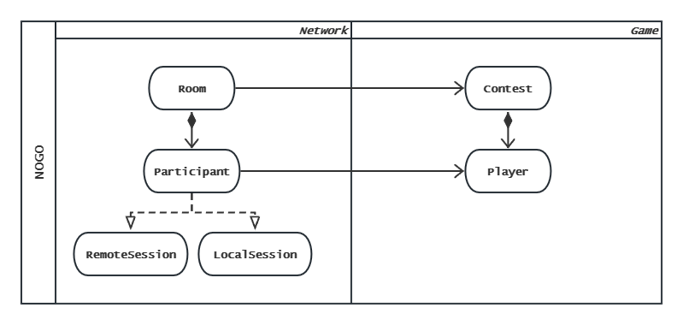
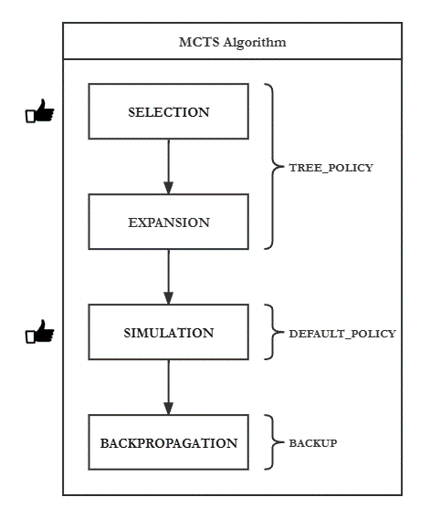
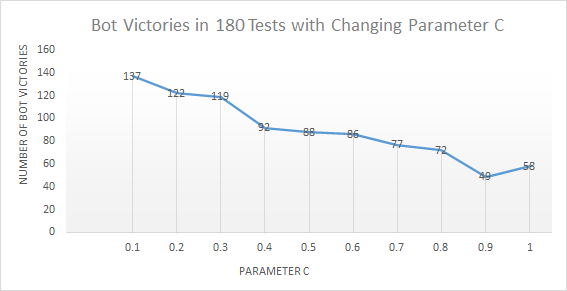
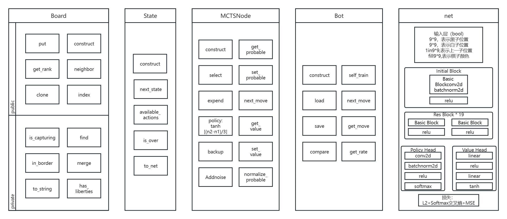

# 2023 程序设计 Ⅱ 大作业：不围棋
# 实验报告

中国人民大学 图灵实验班 李知非 彭文博 魏子洪

# 项目特色


## 卓越灵活的架构


### 网络层面与游戏层面分离


本组实现了网络层面与游戏层面的分离，使程序更加模块化和可维护。我们使用了Asio库来处理网络层面的通信，决定了如何处理收到的Message或发送Message。我们在Asio的基础上封装了自己的Message类，定义了消息的各字段，以及不同类型的消息对应的枚举值。我们还实现了一个MessageHandler类，负责对收到的Message进行解析和分发，根据不同类型的消息调用不同的回调函数。

我们在游戏层面实现了与游戏相关的逻辑，涉及到Board类, State类等。Board类是一个二维数组，表示棋盘上每个位置的状态，它提供了一些方法来判断一个位置是否为空、是否有棋子、是否被包围等。State类是一个保存了当前游戏状态的类，它包含了一个Board对象、上一步的下棋位置、当前轮到谁下棋等信息，它提供了一些方法来判断一个落子是否合法、是否有吃子、是否有禁入点等。

网络层面是游戏层面的下游。游戏层面本身不涉及到任何网络消息收发，这种设计让我们可以更灵活地修改和扩展游戏功能，也让我们的代码更清晰和易读。

### 前后端分离


本组创造性地采用了前后端分离的架构，在各个小组中独树一帜。

我们以类RESTful API的风格，设计了一套统一的协议和数据格式，用于后端与前端、远程玩家交换信息。在规定统一资源标识符 (URI) 来表示不同资源的基础上，我们设计了自己的协议和数据格式，用JSON来表示数据，用不同类型的Message来表示不同类型的请求或响应。例如，当一个玩家想要加入一个游戏时，他会发送一个START_GAME类型的Message，其中包含了他的用户名和执棋颜色等信息；当后端收到这个Message时，它会判断是否有空余的位置，并且返回一个JOIN_GAME_ACK类型的Message作为反馈，其中包含了是否成功加入以及失败原因等信息。

这种设计的含义在于：后端作为Server，前端和远程玩家作为Client，在网络层中均体现为Participant。进一步地，我们在前端和后端分别使用不同的技术栈和语言，只要遵循相同的协议和数据格式，就可以实现通信和交互。这样可以提高开发效率和灵活性，也可以方便地进行测试和调试。

我们还应用了面向对象中多态的概念，让LocalSession与RemoteSession继承于Participant，提高了复用性。由于前端毕竟和后端处于同一台物理主机，比如就不应该在前端退出之前断开连接，所以我们需要对LocalSession和RemoteSession进行不同的处理。利用多态的特性，LocalSession和RemoteSession分别重写了Participant的虚函数，实现了各自的逻辑。例如，当收到一个QUIT类型的Message时，LocalSession会直接忽略，而RemoteSession会关闭连接并从Room中移除。这样，我们就可以在网络层中使用Participant的指针或引用来操作不同类型的Session，而不需要进行类型判断或转换。这样可以提高代码的可读性和可扩展性。

我们为日后添加观战功能保留了接口，逻辑上可以添加其他非玩家的参与者。这些参与者可以作为观众，只能接收游戏的信息，不能发送游戏的请求。我们未来的观战功能可以让更多的人参与到我们的游戏中，观看精彩的对局，学习高手的技巧，增加游戏的趣味性和社交性。为了实现观战功能，我们计划在我们的协议和数据格式中新增几个约定的消息类型或类RESTful API。例如，我们需要新增一个WATCH_GAME类型的Message，用于让观众申请观看一个正在进行的游戏；我们还需要新增一个UPDATE_GAME类型的Message，用于让后端向观众发送游戏的最新信息，比如棋盘状态、玩家信息、走子位置等。我们还需要在后端中维护一个观众列表，用于记录当前正在观看游戏的所有参与者，并且在有新的信息时及时地向他们发送消息。我们还需要在前端中实现一个观战界面，用于让观众可以方便地选择和切换想要观看的游戏，并且可以实时地看到游戏的画面和信息。通过这些设计和实现，我们可以让我们的游戏更加丰富和有趣。

## 健壮可靠的逻辑
本组采用了防御性编程的方法，对输入数据进行了强校验，确保了数据的合法性和安全性。我们尝试考虑所有可能出现的情况，包括正常的、异常的、错误的、恶意的等，并且对每种情况都进行合理的处理，从而避免程序因为错误的输入而崩溃或者产生不可预料的结果，同时防止恶意的攻击或者篡改。我们在程序中对输入数据进行了强校验，即对输入数据的类型、格式、范围、长度等进行了严密的检查，只有符合要求的数据才能被接受和处理，否则会被拒绝或者提示用户重新输入。这样，我们就保证了数据的合法性和安全性，提高了程序的可靠性和稳定性。

我们的程序具有很强的鲁棒性，能够处理各种异常情况和错误输入，即使遇到Client出现异常或行为与协议不符等各种问题，Server仍然能够正常运行或者优雅地退出，而不是崩溃或者产生错误的结果。我们在程序中大量使用了`Exceptions`，通过抛出和捕获异常，来实现程序的鲁棒性。当程序遇到异常时，它会停止当前的执行流程，并且抛出一个异常对象。这个异常对象可以被其他部分的代码捕获，并且进行相应的处理。这样，我们就可以在程序中预设一些异常处理器，来处理可能发生的异常，而不是让程序崩溃或者继续执行错误的逻辑。使用`Exceptions`可以让我们更容易地发现和定位问题，也可以让我们更灵活地控制程序的行为。

在小组模拟测试中，我们发现了一些问题，比如数据类型不匹配、数组越界、空指针等，这些都是常见的异常情况。我们及时地修改了代码，使用了try...catch...finally语句来处理这些异常，并且在catch块中打印了异常信息和堆栈跟踪，方便我们调试和定位问题。我们还在finally块中释放了一些资源，比如关闭文件流、断开网络连接等，以防止资源泄露或者占用。通过这样的方式，我们提高了程序的质量和效率。

## 精致高雅的实现
本组大量使用了 C++ 的现代特性，使程序更加简洁、安全和高效。

### Ranges Library
本组在业务逻辑中大量使用了 Ranges library (C++20). Ranges library 为处理元素的范围提供了一个更高层次的抽象，旨在使开发者更易于编写简明高效的代码，已成为对 C++ 标准库的重要补充。

Ranges library 允许我们通过 operator | 将多个算法或视图组合在一起，来采取函数式编程的风格提升表现力；同时，其惰性求值的特性，也能避免不必要的中间结果和内存分配。

以下是 nogo-backend/rule.hpp 中的一个例子：

```c++
auto available_actions() const
{
    return board.index() | ranges::views::filter([&](auto pos) {
        return !board[pos] && next_state(pos).is_over();
    }) | ranges::to<std::vector>();
}
```

### Asio Library 

本组使用了 Asio library 来实现网络的相关功能。Asio library 是一个用于网络和低级 I/O 编程的第三方 C++ 库，提供了一种现代而协调的异步模型，是目前开发网络应用的热门选择. 

通过将 Asio library 与 Coroutines (C++20) 相结合，我们消解了异步编程的复杂性，以同步的方式写异步的代码，既避免了多线程编程中诸如 Data Racing, Dead Lock 此类的棘手难题，又避免了常规的同步代码的“回调地狱”的问题，在高性能的同时保证了可读性。

以下是 nogo-backend/room.hpp 中的一个例子：

```c++
awaitable<void> reader()
{
    asio::streambuf buffer;
    std::istream stream(&buffer);
    for(std::string message;;) {
        co_await asio::async_read_until(socket, buffer, '\n', asio::use_awaitable);
        std::getline(stream, message);
        co_await on_message(message);
    }
}
```

## 便捷高效的集成
我们在项目中使用了 Guthub Actions, Google Test, spdlog 等流行的第三方工具，作为本组的工程化实践。这些工具为我们提供了高效的自动构建、单元测试和日志管理的功能，有助于我们及时发现和修复 bug，并在小组联机时快速定位问题所在。

### 自动构建
我们使用了 GitHub Actions 来实现自动构建。
通过编写 GitHub Actions 的配置文件，我们实现了自动在 Windows 上的 MSVC、在 Windows 上的 MinGW 和在 Ubuntu 上的 g++ 三种环境下分别进行编译测试。这样，我们就可以在每次提交代码后或有新的 Pull Request 时自动进行编译，以保证代码的可用性。这极大的方便了我们的团队协作，避免了合并代码时可能出现的由于合并冲突导致的编译失败。同时也提高了代码的可移植性。
### 测试
我们认为，测试是一个非常重要和必要的环节，在测试中发现并解决问题，可以让程序更加可靠、可信。
我们使用了 Google Test 来进行单元测试。Google Test 是由 Google 开发的 C++ 测试和模拟框架，旨在编写独立、可重复、可组织、可移植、可扩展的测试。

在测试中，我们使用了 TEST 宏来定义一个测试用例。其中，我们创建了一个表示服务器进程的 ServerProcess 对象，并利用 RAII 原则，在测试开始时启动 nogo_server 程序，并在测试结束时自动终止。接着，我们创建了两个 Session 对象，分别表示连接到不同端口的 TCP 连接的会话。
通过这两个客户端，我们交替地向服务器发送消息。最后，我们分别比较了两个客户端接收到的消息与预期的消息是否匹配，以确保服务器的消息处理功能正常运行。
### 日志
为实现日志功能，我们采用了 spdlog 这一轻量级的 C++11 日志管理库。spdlog 只包含头文件，使用起来非常方便，相比于 glog 有更多的优势。利用 spdlog 提供的接口，我们编写了一些辅助代码，使得我们可以轻松地将日志同时输出到控制台和按照不同的日志等级分别存储到多个文
件中。

我们还将 spdlog 与 format 库相结合，规定了对 Player 类等类型的 format 格式，方便 log 的时候直接进行输出。format 库是一个提供了高效和灵活的字符串格式化功能的库，它可以让我们使用类似于 Python 的 format 语法来构造字符串。我们在 Player 类中重载了 format 的自定义格式化函数，让它可以根据不同的格式说明符来输出 Player 对象的不同属性，比如用户名、执棋颜色等。这样，我们就可以在 log 的时候使用 format 语法来输出 Player 对象信息，而不需要手动拼接字符串。

以下是 nogo-backend/contest.hpp 中的一个例子，将一条信息级别的日志输出到控制台，并保存到 info.log 文件中，同时附上玩家的数据：
```c++
logger->info("player data:{}", player);
```

在整个项目中，我们广泛地使用了 spdlog 来记录日志。无论是接收、发送、解析信息，还是进行关键的逻辑处理和异常处理，我们都会通过日志来记录程序的运行状态和可能出现的问题。这样做有助于我们及时发现和修复 bug，并在小组联机时快速定位问题所在。

## 用户友好的界面
前端部分，本组采用了 Electron + Vue 3 + TypeScript 的技术栈。

- 优雅的审美追求和超远的审美境界
- 用户友好、直观、简洁
- 流行的设计语言

## 研磨至臻的算法


本组实现了蒙特卡洛搜索 (MCTS) 算法，来让我们的AI玩家能够做出智能的决策。MCTS是一种基于蒙特卡洛模拟的搜索算法，它可以在不需要完整的搜索空间和评估函数的情况下，找到近似最优的行动。MCTS有四个阶段：选择、扩展、模拟和回溯。在选择阶段，MCTS从根节点开始，根据一定的策略，选择最有价值的子节点，直到到达一个未完全展开的节点。在扩展阶段，MCTS从未完全展开的节点中随机选择一个未被访问过的子节点，并将其加入到搜索树中。在模拟阶段，MCTS从扩展的子节点开始，随机地进行一次完整的游戏模拟，直到到达一个终止状态。在回溯阶段，MCTS根据模拟的结果，更新从扩展的子节点到根节点的所有节点的统计信息，比如访问次数和平均收益等。通过反复进行这四个阶段，MCTS可以逐渐增加搜索树的规模和质量，并且在给定时间内选择最佳的行动。

在小组模拟测试中，我们的AI玩家与其他小组的AI玩家进行对战，战果累累、几无败绩。我们分析了我们的AI玩家的优势所在，发现有以下几点：一是我们的AI玩家效率较高，能够充分利用给定的时间，进行尽可能多的模拟，从而提高搜索树的覆盖率和精度；二是我们的AI玩家能够根据不同阶段和局面，动态调整搜索策略和模拟策略，从而更好地平衡探索和利用；三是我们的AI玩家能够利用一些启发式信息和先验知识，来剪枝无效或低效的节点，从而节省计算资源和提高搜索效率。



除了强悍的算法表现，我们还对该AI算法的性能进行了进一步优化。我们认为，优化的目的是在不损失代码可读性的前提下，提高程序的效率。为了达到这个目的，我们需要先确定一个评价标准，来衡量我们的程序的性能水平，然后再寻找可能存在的性能瓶颈，最后看看优化方法能带来多少性能提升，是否值得牺牲一些代码可读性。我们选择了 MCTS 搜索在树中扩展的节点数量作为评价标准，这个指标可以反映我们的程序的效率和优劣。我们发现，选择阶段和模拟阶段是优化的主要方面。通过大量实验，我们比较了不同优化方法对这个指标的影响，从而找到了最适合的优化方案，提出了选择阶段参数C的最佳取值和模拟阶段的一种局面估值方法。其中，C是一个重要的参数，决定了MCTS在选择阶段使用UCB1公式时对探索和利用之间的权衡。C越大，表示越倾向于探索未知或不确定的节点；C越小，表示越倾向于利用已知或确定的节点。我们通过实验发现，在我们的游戏中，当C取0.1时，可以达到最佳的效果。另外，我们还提出了一种局面估值方法，在模拟阶段结束时快速给出一个局面的评分。这个评分不仅考虑了棋盘上双方棋子数目之差，还考虑了棋盘上双方棋子分布之差、棋盘上双方棋子活度之差、棋盘上双方棋子气数之差等因素。这样可以更准确地反映一个局面对双方玩家的优劣程度。

值得一提的是，我们还应用了多线程编程的相关内容，将AI玩家分离出主线程、在一个单独的线程中运行MCTS算法，而主线程负责与网络层和前端进行通信。这样可以避免AI玩家的计算过程阻塞主线程，也可以让AI玩家更快地响应网络层和前端的消息，充分利用了多核处理器的性能，提高程序的并行度和效率。我们还使用了std::mutex和std::lock_guard来保证多个线程对共享数据的互斥访问，避免数据竞争和不一致的问题。std::mutex是一个互斥锁，它可以保证同一时间只有一个线程可以访问共享数据；std::lock_guard是一个提供RAII机制的mutex wrapper，它可以在构造时自动加锁，在析构时自动解锁，简化了对锁的管理和使用。



我们意识到，我们的算法仍有很大的改进空间。我们将学习 AlphaGo 的经验，将模拟阶段进一步替换为一个快速走子网络，并利用 Caffe 框架实现该神经网络。Caffe 是一个开源的深度学习框架，它提供了高效的数据处理和模型训练的功能，支持多种硬件平台和编程语言。我们希望通过使用 Caffe 框架，构建一个快速走子网络，根据当前局面给出一个最佳的走子位置，而不需要进行启发式的估值。这样可以大大提高模拟阶段的准确性和效率，从而提高 MCTS 算法的整体性能。我们还计划使用 Caffe 框架来实现一个策略网络和一个价值网络，分别用于指导 MCTS 的选择阶段和回溯阶段。策略网络可以根据当前的局面，给出每个可行走子位置的概率分布，从而帮助 MCTS 更快地找到有价值的节点；价值网络可以根据当前的局面，给出一个预测的胜率，从而帮助 MCTS 更准确地评估节点的收益。这两个网络都需要通过大量的数据和训练来优化参数和提高准确性。我们希望通过机器学习方法，进一步提升该算法，使 AI 玩家更接近人类水平。

## 分工协作

李知非同学 主要负责项目总体架构与后端开发工作。

彭文博同学 主要负责前端开发与 UI 设计工作。

魏子洪同学 主要负责测试与文档，参与前后端开发工作。

## 展望

## 致谢

感谢孙亚辉老师在课程中提供的指导与帮助，使我们收获宝贵经验，掌握编程原理。

感谢潘俊达助教在项目中给予我们的大力支持，使我们拥有发挥创意、自由
探索的机会。

感谢王卓冉助教在项目中给予我们指点和建议，使我们迸发对本项目的深入思考。

同时，感谢赵培宇同学利用宝贵的时间帮助我们测试程序，并且发现了一个会导致部分电脑上无法运行的严重问题。
