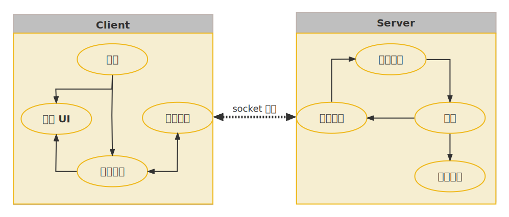
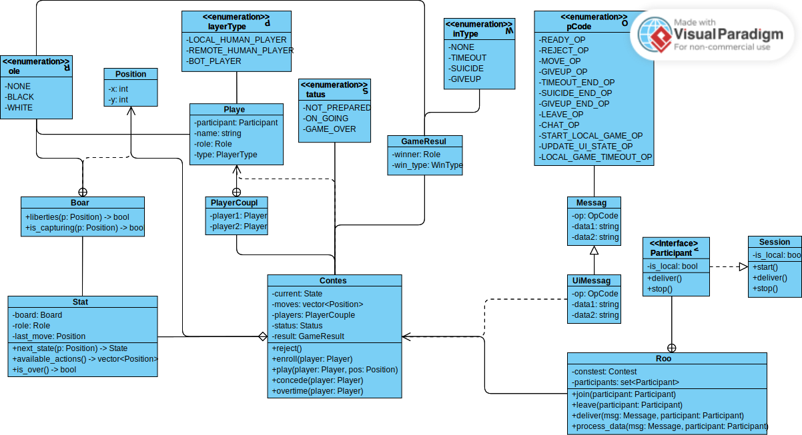

# 2023 程序设计 Ⅱ 大作业：不围棋
# 第一阶段实验报告

中国人民大学 图灵实验班 李知非 彭文博 魏子洪

## 分工
李知非同学 主要负责项目总体架构与后端开发工作。

彭文博同学 主要负责前端开发与 UI 设计工作。

魏子洪同学 主要负责测试与文档，参与前后端开发工作。

## 架构

### 技术路线

本组创造性地采用了前后端分离的架构，在各个小组中独树一帜。
本组的技术路线，兼具 **Modern** 与 **Standard** 两大特征，堪为规范、良好的 C++ 工程实践。

### Modern Way

#### Electron

! [[Qt -> Electron]]

#### Modern C++

Modern C++ 是指 C++11 及以后的 C++ 标准，它引入了许多新的语言特性和库功能，使得 C++ 代码更加简洁、安全、高效和现代化。

Modern C++ 的优势主要有以下几点：

- 提供了 Smart pointers, String views, Range-based for loop 等功能，可以避免内存泄漏、空指针解引用、缓冲区溢出等常见的错误。
- 支持 Lambda expression, Type inference, CTAD 等功能，可以简化代码的编写和阅读，提高代码的可读性和可维护性。
- 支持移动语义、右值引用、完美转发等功能，可以减少不必要的拷贝和构造，提高代码的性能和效率。
- 支持 `constexpr` expression, Template variable, `if constexpr` 等功能，可以在编译期进行更多的计算和优化，提高代码的运行时性能和安全性。
- 支持 Parallel algorithms, Atomic operations, Threads 等功能，可以方便地编写多线程和并发程序，充分利用多核处理器的能力。
- 支持 Variadic template, Delegating constructors, Inheriting Constructor 等功能，可以增强类的设计和实现，提高代码的复用性和扩展性。
- 支持 `std::variant`, `std::optional`, `std::any` 等功能，可以实现类型安全的联合体、空值处理和动态类型转换，提高代码的灵活性和鲁棒性。
- 支持 Modules ，可以实现无头文件和宏的代码组织方式，提高编译速度、代码可读性和模块化。

以上的每一点，本组的实现中均有所体现。

#### nlohmann_json library

本组在网络消息部分解析 JSON 时使用了 nlohmann_json library。作为十分流行的现代 C++ 库，nlohmann_json library 利用许多现代 C++ 的特性，提供了简洁而直观的接口，使我们可以像操作内置数据类型一样操作 JSON 对象。同时，它也号称拥有业界最好的性能，在不同的 benchmark 中都表现出色。

以下代码演示了创建一个 JSON 对象并转换为对应的字符串：
```c++
json j = R"(
    {
        "name": "Bob",
        "age": 30,
        "hobbies": ["gaming", "music", "traveling"],
        "address": {
        "city": "Shanghai",
        "zip": 200000
        }
    }
)"_json;

std::string s = j.dump();
```

详见`nogo-backend/message.hpp`.

### Standard Way

#### Ranges library

本组在业务逻辑中大量使用了 Ranges library (C++20). Ranges library 为处理元素的范围提供了一个更高层次的抽象，旨在使开发者更易于编写简明高效的代码，已成为对 C++ 标准库的重要补充。
Ranges library 允许我们通过 `operator |` 将多个算法或视图组合在一起，来采取函数式编程的风格；同时，其惰性求值的特性，也能避免不必要的中间结果和内存分配。例如：

```c++
std::vector numbers { 1, 2, 3 ,4, 5 };
auto results = numbers 
    | std::views::filter([](int n) { return n % 2 == 0; })
    | std::views::transform([](int n) { return n * 2; });
```

详见`nogo-backend/rule.hpp`.

#### Asio library

本组使用了 Asio library 来实现网络的相关功能。Asio library 是一个用于网络和低级 I/O 编程的第三方 C++ 库，提供了一种现代而协调的异步模型，是目前开发网络应用的热门选择.

结合 Asio library 与 Coroutines (C++20)，我们消解了异步编程的复杂性，避免了诸如“回调地狱”等问题。通过 Asio 提供的 `awaitable` 类模板, `use_awaitable` 完成令牌和 `co_spawn` 函数, 以及 C++20 引入的 `co_await` 关键字，我们用少量代码就能实现一个简易的 echo server:
```c++
asio::co_spawn(executor, echo(std::move(socket)), asio::detached);
// ...
asio::awaitable<void> echo(tcp::socket socket)
{
  try
  {
    char data[1024];
    for (;;)
    {
      std::size_t n = co_await socket.async_read_some(asio::buffer(data), asio::use_awaitable);
      co_await async_write(socket, asio::buffer(data, n), asio::use_awaitable);
    }
  }
  catch (std::exception& e)
  {
    std::printf("echo Exception: %s\n", e.what());
  }
}
```
详见`nogo-backend/server.hpp`.

虽然 Asio library 未能按原计划进入 C++23 标准，但其仍是目前有望进入 C++26 标准的网络库中呼声最高的方案。

### 项目结构



#### 前端

![[add here]]

#### 后端



### 展望

非常遗憾地是，由于主流编译器并未完全实现 C++23 标准的所有特性，我们的项目未能完全利用其优势。同时，我们在采用 Modules, Ranges library 等新特性时，也发现了 Visual C++ Internal Compiler Error 与 g++ Segmentation Fault 等编译器内部错误。在向编译器厂商提出 issue 等待修复的同时，我们也作出了一定的技术妥协，被迫放弃了一些简洁而优雅的特性。未来几个月，我们将持续关注 C++23 标准的进展与编译器厂商的修复进度，期望这些问题能够得到改善。

“周虽旧邦，其命维新”。我们坚信，随着 Modern C++ 的发展，C++ 这门古老的语言必将焕发新生，迸发出强大生命力。

### 鸣谢

感谢孙亚辉老师提供的指导与帮助，使我们收获宝贵经验，掌握编程原理。

感谢潘俊达助教大力支持，给予我们发挥创意、自由探索的机会。
